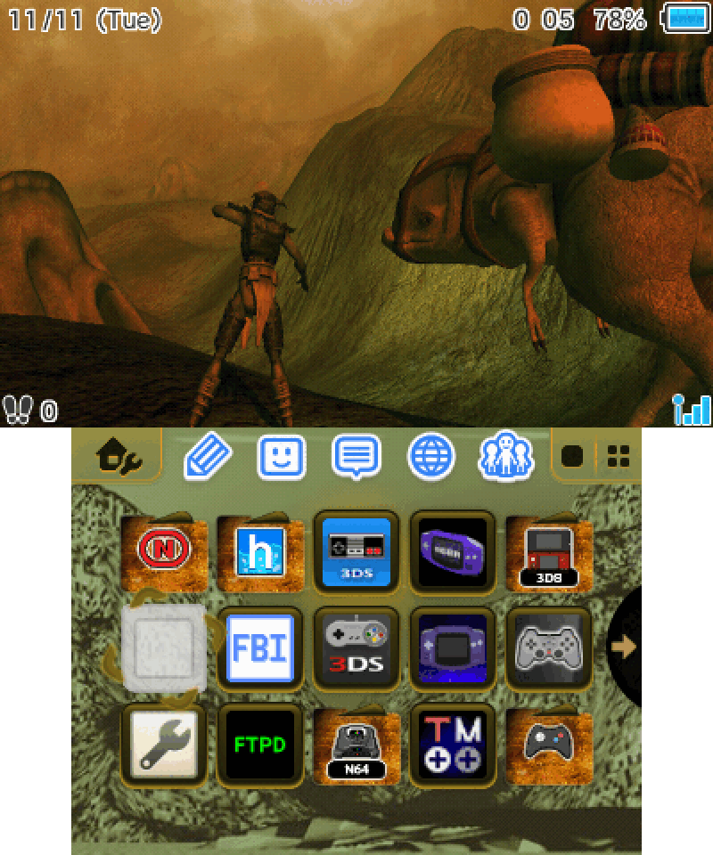

# 3DS Custom Home Menu with Battery display
A custom 3DS home menu born out of an attempt to combine [R-YaTian's battery patches](https://github.com/R-YaTian/3ds-battery-patches) with [Kitsune's custom menu](https://aromakitsune.github.io/3DS-Custom-Home-Menu-UI), while removing parts of Kitsune's menu I disliked. Currently only supports the USA home menu.

## How to install
Download the [latest release](https://github.com/3saster/3DS_HomeMenu_Battery/releases), then follow the instructions [here](https://aromakitsune.github.io/3DS-Custom-Home-Menu-UI#adding-the-home-menu-applet-patch).

## What's edited
- Battery icon displays each bar as 25% of charge (from R-YaTian)
- Battery percentage displayed next to battery icon  (from R-YaTian)
- L+R and Y buttons on top screen removed
- Date HUD moved to the top left corner of the top screen
- Removed the connection bar and its texts (Internet, StreetPass, etc.), leaving only the signal indicator, which has been moved to the bottom right
- Play Coins count and steps count moved to the bottom left corner of the top screen
- Blue applet icons (from Kitsune)
- Spinning cursor (from Kitsune)
- Blue shutdown screen (from Kitsune)

## Screenshots
