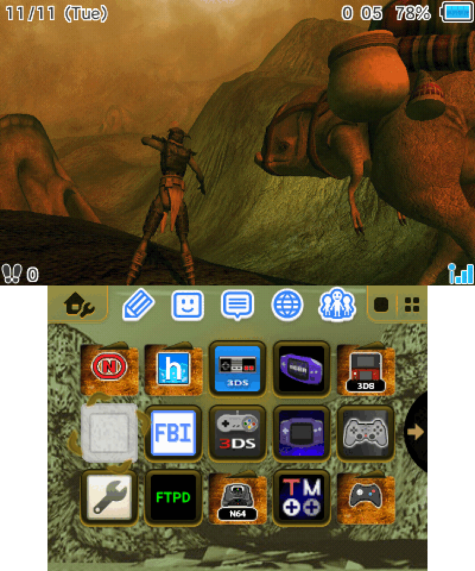

# 3DS Custom Home Menu with Battery display
A custom 3DS home menu born out of an attempt to combine [R-YaTian's battery patches](https://github.com/R-YaTian/3ds-battery-patches) with [Kitsune's custom menu](https://aromakitsune.github.io/3DS-Custom-Home-Menu-UI), while removing parts of Kitsune's menu I disliked.

## How to install
Ensure you are on system firmware version `11.17.0-50` or higher.
1. Download the appropriate archive for your region from the [latest release](https://github.com/3saster/3DS_HomeMenu_Battery/releases) page and extract it.
2. Copy the `luma` folder to the root of your SD card.
3. Ensure Luma3DS game patching is enabled. To do this, hold the Select Button while booting the console to enter the Luma3DS menu, make sure the "Enable game patching" box is checked, then save and exit.

## How to uninstall
Simply delete the the following folder off your SD card depending on your region:
- USA: `luma/titles/0004003000008F02`
- EUR: `luma/titles/0004003000009802`
- JPN: `luma/titles/0004003000008202`

## What's edited
- Battery icon displays each bar as 25% of charge (from R-YaTian)
- Battery percentage displayed next to battery icon  (from R-YaTian)
- L+R and Y buttons on top screen removed
- Date HUD moved to the top left corner of the top screen
- Removed the connection bar and its texts (Internet, StreetPass, etc.), leaving only the signal indicator, which has been moved to the bottom right
- Play Coins count and steps count moved to the bottom left corner of the top screen
- Blue applet icons (from Kitsune)
- Optional Spinning cursor (from Kitsune)
- Blue shutdown screen (from Kitsune)

## Screenshots
